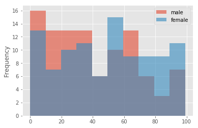

# Python Matplotlib

[Matplotlib](https://github.com/CFerraren/Python-Matplotlib/blob/master/0.1_Matplotlib.ipynb) functions that are useful in visualizing data in data analysis.

## Visualization

> Depends  on which apsect of our data we want to demonstrate:

*  `` Data Value ``

*  `` Data Distribution ``

*  `` Data Concentration``

*  `` Data Composition ``

### Data Value

- [x] 1.0_[Plot](https://github.com/CFerraren/Python-Matplotlib/blob/master/1.0_Plot.ipynb)

- [x] 1.1_[Series Plot](https://github.com/CFerraren/Python-Matplotlib/blob/master/1.1_Series%20Plot.ipynb)
        
        
        Suitable for high granularity. You can used it to evaluate patterns and behavior in data over time.
        
        Especially good for time-series data like stock-price.
        

- [x] 1.1_[Bar Plot](https://github.com/CFerraren/Python-Matplotlib/blob/master/1.2_Bar%20Plot.ipynb)

        Suitable for low granularity. You can use it to compare the difference among observations and evaluate the pattern.
        
        Example will be company annual revenue

        

### Data Distribution

- [x] 2.0_[Histogram](https://github.com/CFerraren/Python-Matplotlib/blob/master/2.0_Histogram.ipynb)
        
        Good for demonstrating frequencies of the values.
        
        A good example will be comparing of gender (male vs females) in the SAT exam.
        
        Another in when comparing number of customer chooses Product A, Product B, and Product C.
        
        

        
- [x] 2.1_[Box Plot](https://github.com/CFerraren/Python-Matplotlib/blob/master/2.1_Box%20Plot.ipynb)
        
        To show the overall distribution of the data. It's visualized descriptive staistic, you see the maximum, the 3rd quartile, the median, the 1st quartile, and the minimum.
        

        

### Data Concentration

- [x] 3.0_[Scatter Plot](https://github.com/CFerraren/Python-Matplotlib/blob/master/3.0_Scatter%20Plot.ipynb)
        
        Requires two axes, shows the distribution pattern of the data, but more often used to evaluate if the data is concentrating in a certain area.
        
        Suitable for small to medium size samples.
        
        

        
- [x] 3.1_[Hexagon Binning Plot (Heat Map)](https://github.com/CFerraren/Python-Matplotlib/blob/master/3.1_Heat%20Map.ipynb)
        
        Suitable for large samples.
        
        It is easier to read where is the data concentrated on. the deeper the color, the more the area is intensively concentrated.
        
        

        

### Data Composition

- [x] 4.0_[Pie Plot](https://github.com/CFerraren/Python-Matplotlib/blob/master/4.0_Pie%20Plot.ipynb)
        
        For cross-sectional data (at a certain point of time). shows the proportion of different parts in a sum. 
        
        Example: Revenue composition (ads, sales, promotions, etc..)

        

        
- [x] 4.1_[Area Plot](https://github.com/CFerraren/Python-Matplotlib/blob/master/4.1_Area%20Plot.ipynb)
        
        For time-series data (with composition changing through time.)
        
        The X axis usually represents time, and the thickness of each color shows the value of that variable. 
        
        Example: how is the revenue composition changing (chair, tables, lamps, ets)
        
        

- [x] 5.0_[Seaborn Library](https://github.com/CFerraren/Python-Matplotlib/blob/master/5.0_Seaborn-Distribution%20Plot.ipynb)
        
        

- [x] 5.1_[Seaborn-Categorical Plot](https://github.com/CFerraren/Python-Matplotlib/blob/master/5.1_Seaborn-Categorical%20Plot.ipynb)

- [x] 5.2_[Seaborn-Correlation Plots](https://github.com/CFerraren/Python-Matplotlib/blob/master/5.2_Seaborn-Correlation%20Plots.ipynb)

- [x] 5.3_[Seaborn-Grid Plots](https://github.com/CFerraren/Python-Matplotlib/blob/master/5.3_Seaborn-Grid%20Plots.ipynb)

- [x] 5.4_[Seaborn-Style](https://github.com/CFerraren/Python-Matplotlib/blob/master/5.4_Seaborn-Style.ipynb)
        